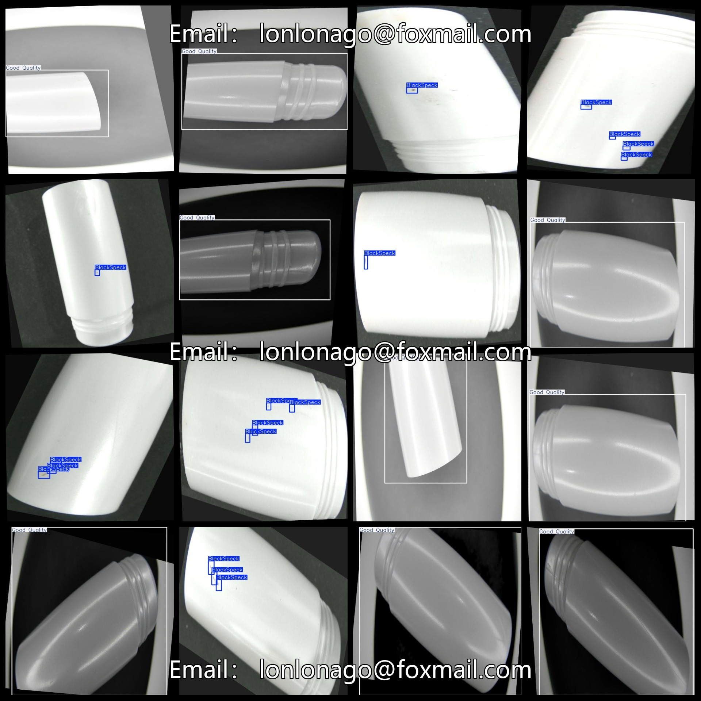
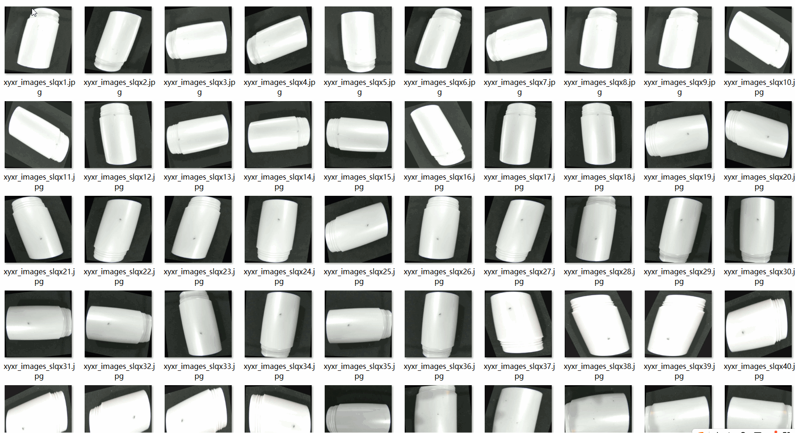

# [Object Detection] Plastic Cup Defect Dataset with 2141 Images in YOLO+VOC Format

[Object Detection] Plastic Cup Defect Dataset with 2141 Images in YOLO+VOC Format

The dataset format includes VOC and YOLO formats.

The compression package contains three folders, each storing images, xml, and txt files.

The JPEGImages folder contains a total of 2141 jpg images.

The Annotations folder contains a total of 2141 xml files.

The labels folder contains a total of 2141 txt files.

There are a total of 4 labels: ["BlackSpeck", "Dirty", "Good Quality", "Scratches"]

The label names are as follows: ["BlackSpeck", "Dirty", "Good Quality", "Scratches"]

The number of frames for each label (notice the category order in YOLO format does not match this, but is based on the classes.txt in the labels folder):

- BlackSpeck: 1487
- Dirty: 138
- Good Quality: 1304
- Scratches: 18

Total frames: 2947

The image resolution is clear.

The images have been enhanced.

The label shapes are rectangular boxes, used for target detection recognition.

Important Notice: No guarantees are made regarding the accuracy or weights of models trained on this dataset. The dataset provides accurate and reasonable annotations only.

The annotation and image conditions are detailed as follows:

## Images

---

Here is a pay link on Stripe (https://buy.stripe.com/3cs8yP7sY87d0vu9AB). Please contact me lonlonago@foxmail.com after funding $89, and I will send you a complete data files, thank you!

